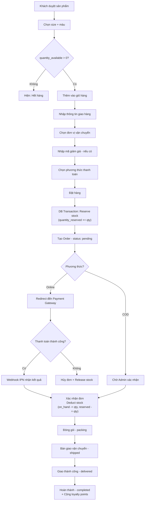

# 🛍️ CLOTHES SHOP — Tài Liệu Context Đầy Đủ
## Context cho việc Build Website Bán Quần Áo Chuyên Nghiệp

> **Nguồn:** Tổng hợp từ NotebookLM notebook `6ce15f20-1cd8-48cc-a628-25295c766063`  
> **Cập nhật:** 2026-08-12

---

## 1. TỔNG QUAN HỆ THỐNG

### 1.1 Mục tiêu nghiệp vụ
Website bán quần áo chuyên nghiệp là nền tảng thương mại điện tử B2C tích hợp đầy đủ:
- Trải nghiệm mua sắm liền mạch cho khách hàng
- Quản lý vận hành toàn diện cho admin/nhân viên
- Tích hợp chuỗi cung ứng: nhà cung cấp → kho → khách hàng
- Tích hợp đa kênh thanh toán và vận chuyển nội địa Việt Nam

### 1.2 Các actor trong hệ thống

| Actor | Vai trò |
|-------|---------|
| **Guest (Khách vãng lai)** | Duyệt sản phẩm, tìm kiếm, xem đánh giá |
| **Customer (Khách hàng)** | Mua hàng, quản lý đơn, đổi trả, đánh giá |
| **Staff (Nhân viên)** | Xử lý đơn hàng, chăm sóc khách hàng |
| **Warehouse (Nhân viên kho)** | Quản lý nhập/xuất kho, kiểm kê |
| **Admin (Quản trị viên)** | Toàn quyền: sản phẩm, khuyến mãi, báo cáo |
| **System (Hệ thống)** | Tự động: cron jobs, webhooks, notifications |

---

## 2. DATABASE SCHEMA ĐẦY ĐỦ

### 2.1 Categories (Danh mục)
```sql
CREATE TABLE categories (
  category_id   UUID PRIMARY KEY DEFAULT gen_random_uuid(),
  parent_id     UUID REFERENCES categories(category_id),  -- self-reference
  name          VARCHAR(100) NOT NULL,
  slug          VARCHAR(120) UNIQUE NOT NULL,
  description   TEXT,
  image_url     VARCHAR(500),
  sort_order    INT DEFAULT 0,
  is_active     BOOLEAN DEFAULT true,
  created_at    TIMESTAMP DEFAULT NOW(),
  updated_at    TIMESTAMP DEFAULT NOW()
);
-- Ví dụ phân cấp:
-- L1: Áo (ao), Quần (quan), Váy (vay), Phụ kiện (phu-kien)
-- L2: Áo thun, Áo sơ mi, Áo khoác, Áo polo...
-- L3: Áo thun tay ngắn, Áo thun tay dài...
```

### 2.2 Brands (Thương hiệu)
```sql
CREATE TABLE brands (
  brand_id    UUID PRIMARY KEY DEFAULT gen_random_uuid(),
  name        VARCHAR(100) NOT NULL,
  slug        VARCHAR(120) UNIQUE NOT NULL,
  logo_url    VARCHAR(500),
  description TEXT,
  is_active   BOOLEAN DEFAULT true
);
```

### 2.3 Colors (Màu sắc)
```sql
CREATE TABLE colors (
  color_id   UUID PRIMARY KEY DEFAULT gen_random_uuid(),
  name       VARCHAR(50) NOT NULL,     -- "Đỏ đô", "Xanh navy"
  hex_code   VARCHAR(7),              -- "#8B0000"
  is_active  BOOLEAN DEFAULT true
);
```

### 2.4 Products (Sản phẩm)
```sql
CREATE TABLE products (
  product_id   UUID PRIMARY KEY DEFAULT gen_random_uuid(),
  category_id  UUID NOT NULL REFERENCES categories(category_id),
  brand_id     UUID REFERENCES brands(brand_id),
  name         VARCHAR(255) NOT NULL,
  slug         VARCHAR(280) UNIQUE NOT NULL,
  description  TEXT,
  care_instructions TEXT,            -- Hướng dẫn bảo quản
  material     VARCHAR(200),         -- Chất liệu
  base_price   DECIMAL(12,0) NOT NULL CHECK (base_price >= 0),
  sale_price   DECIMAL(12,0) CHECK (sale_price >= 0),
  sale_start   TIMESTAMP,
  sale_end     TIMESTAMP,
  is_active    BOOLEAN DEFAULT true,
  is_featured  BOOLEAN DEFAULT false,
  meta_title   VARCHAR(70),          -- SEO
  meta_desc    VARCHAR(160),         -- SEO
  created_at   TIMESTAMP DEFAULT NOW(),
  updated_at   TIMESTAMP DEFAULT NOW()
);

-- Computed: giá hiển thị
-- display_price = CASE WHEN sale_price IS NOT NULL 
--   AND NOW() BETWEEN sale_start AND sale_end 
--   THEN sale_price ELSE base_price END
```

### 2.5 Product Images (Hình ảnh sản phẩm)
```sql
CREATE TABLE product_images (
  image_id    UUID PRIMARY KEY DEFAULT gen_random_uuid(),
  product_id  UUID NOT NULL REFERENCES products(product_id) ON DELETE CASCADE,
  color_id    UUID REFERENCES colors(color_id),  -- Ảnh cho màu cụ thể
  url         VARCHAR(500) NOT NULL,
  alt_text    VARCHAR(255),
  sort_order  INT DEFAULT 0,
  is_primary  BOOLEAN DEFAULT false
);
```

### 2.6 Product Variants (Biến thể sản phẩm)
```sql
CREATE TABLE product_variants (
  variant_id        UUID PRIMARY KEY DEFAULT gen_random_uuid(),
  product_id        UUID NOT NULL REFERENCES products(product_id) ON DELETE CASCADE,
  color_id          UUID NOT NULL REFERENCES colors(color_id),
  size              VARCHAR(10) NOT NULL,  -- XS|S|M|L|XL|XXL|2XL|38|40|42...
  sku               VARCHAR(100) UNIQUE NOT NULL,  -- Mã định danh duy nhất
  price_adjustment  DECIMAL(12,0) DEFAULT 0,  -- Chênh lệch giá so với base
  weight            DECIMAL(6,2),  -- gram, dùng tính phí ship
  is_active         BOOLEAN DEFAULT true,
  UNIQUE(product_id, color_id, size)
);
```

### 2.7 Inventory (Tồn kho) — Bảng quan trọng nhất
```sql
CREATE TABLE inventory (
  inventory_id     UUID PRIMARY KEY DEFAULT gen_random_uuid(),
  variant_id       UUID NOT NULL REFERENCES product_variants(variant_id),
  warehouse_id     UUID REFERENCES warehouses(warehouse_id),
  quantity_on_hand INT NOT NULL DEFAULT 0 CHECK (quantity_on_hand >= 0),
  quantity_reserved INT NOT NULL DEFAULT 0 CHECK (quantity_reserved >= 0),
  -- quantity_available = quantity_on_hand - quantity_reserved
  reorder_point    INT DEFAULT 5,   -- Ngưỡng cảnh báo sắp hết
  last_updated     TIMESTAMP DEFAULT NOW(),
  UNIQUE(variant_id, warehouse_id),
  CONSTRAINT chk_available CHECK (quantity_on_hand >= quantity_reserved)
);

-- BUSINESS RULE QUAN TRỌNG:
-- quantity_available = quantity_on_hand - quantity_reserved (KHÔNG ĐƯỢC ÂM)
-- Khi tạo đơn hàng: quantity_reserved += qty
-- Khi xác nhận đơn: quantity_on_hand -= qty, quantity_reserved -= qty  
-- Khi hủy đơn:     quantity_reserved -= qty  (trả lại kho)
```

### 2.8 Customers (Khách hàng)
```sql
CREATE TABLE customers (
  customer_id     UUID PRIMARY KEY DEFAULT gen_random_uuid(),
  email           VARCHAR(255) UNIQUE NOT NULL,
  phone           VARCHAR(20) UNIQUE,
  password_hash   VARCHAR(255) NOT NULL,
  full_name       VARCHAR(200) NOT NULL,
  gender          VARCHAR(10) CHECK (gender IN ('male','female','other')),
  date_of_birth   DATE,
  avatar_url      VARCHAR(500),
  tier            VARCHAR(20) DEFAULT 'regular' CHECK (tier IN ('regular','silver','gold','diamond')),
  loyalty_points  INT DEFAULT 0 CHECK (loyalty_points >= 0),
  is_active       BOOLEAN DEFAULT true,
  email_verified  BOOLEAN DEFAULT false,
  created_at      TIMESTAMP DEFAULT NOW(),
  last_login      TIMESTAMP
);
-- Tier rules: Silver ≥5tr, Gold ≥15tr, Diamond ≥30tr (tổng 12 tháng)
-- Loyalty: 1 point per 1,000đ chi tiêu; 1 point = 100đ khi đổi quà
```

### 2.9 Customer Addresses (Địa chỉ giao hàng)
```sql
CREATE TABLE customer_addresses (
  address_id    UUID PRIMARY KEY DEFAULT gen_random_uuid(),
  customer_id   UUID NOT NULL REFERENCES customers(customer_id) ON DELETE CASCADE,
  full_name     VARCHAR(200) NOT NULL,
  phone         VARCHAR(20) NOT NULL,
  province      VARCHAR(100) NOT NULL,
  district      VARCHAR(100) NOT NULL,
  ward          VARCHAR(100) NOT NULL,
  address_line  VARCHAR(500) NOT NULL,  -- Số nhà, tên đường
  is_default    BOOLEAN DEFAULT false
);
```

### 2.10 Orders (Đơn hàng)
```sql
CREATE TABLE orders (
  order_id          UUID PRIMARY KEY DEFAULT gen_random_uuid(),
  order_number      VARCHAR(20) UNIQUE NOT NULL,  -- #CS202408001
  customer_id       UUID REFERENCES customers(customer_id),
  guest_email       VARCHAR(255),  -- Cho khách mua không đăng nhập
  guest_phone       VARCHAR(20),
  
  -- Trạng thái
  status            VARCHAR(20) NOT NULL DEFAULT 'pending'
                    CHECK (status IN ('pending','confirmed','packing','shipped','delivered','completed','cancelled')),
  payment_status    VARCHAR(20) NOT NULL DEFAULT 'unpaid'
                    CHECK (payment_status IN ('unpaid','paid','refunded','partial_refund')),
  
  -- Địa chỉ (snapshot tại thời điểm đặt hàng)
  shipping_name     VARCHAR(200) NOT NULL,
  shipping_phone    VARCHAR(20) NOT NULL,
  shipping_province VARCHAR(100) NOT NULL,
  shipping_district VARCHAR(100) NOT NULL,
  shipping_ward     VARCHAR(100) NOT NULL,
  shipping_address  VARCHAR(500) NOT NULL,
  
  -- Tiền
  subtotal          DECIMAL(15,0) NOT NULL,  -- Tổng trước giảm giá
  discount          DECIMAL(15,0) DEFAULT 0,
  shipping_fee      DECIMAL(12,0) DEFAULT 0,
  tax               DECIMAL(12,0) DEFAULT 0,
  total             DECIMAL(15,0) NOT NULL,  -- Số tiền thanh toán thực tế
  
  -- Khuyến mãi
  coupon_id         UUID REFERENCES promotions(promotion_id),
  coupon_code       VARCHAR(50),      -- Snapshot mã tại thời điểm đặt
  
  -- Điểm thưởng
  points_used       INT DEFAULT 0,
  points_earned     INT DEFAULT 0,
  
  notes             TEXT,
  cancelled_reason  TEXT,
  created_at        TIMESTAMP DEFAULT NOW(),
  updated_at        TIMESTAMP DEFAULT NOW()
);
```

### 2.11 Order Items (Chi tiết đơn hàng)
```sql
CREATE TABLE order_items (
  order_item_id UUID PRIMARY KEY DEFAULT gen_random_uuid(),
  order_id      UUID NOT NULL REFERENCES orders(order_id) ON DELETE CASCADE,
  variant_id    UUID NOT NULL REFERENCES product_variants(variant_id),
  
  -- Snapshot thông tin sản phẩm tại thời điểm mua
  product_name  VARCHAR(255) NOT NULL,
  variant_sku   VARCHAR(100) NOT NULL,
  size          VARCHAR(10) NOT NULL,
  color_name    VARCHAR(50) NOT NULL,
  
  quantity      INT NOT NULL CHECK (quantity > 0),
  unit_price    DECIMAL(12,0) NOT NULL,  -- Giá tại thời điểm mua
  subtotal      DECIMAL(15,0) NOT NULL,  -- quantity * unit_price
  
  -- Trạng thái đổi trả
  return_status VARCHAR(20) DEFAULT 'none'
                CHECK (return_status IN ('none','requested','approved','rejected','completed'))
);
```

### 2.12 Payments (Thanh toán)
```sql
CREATE TABLE payments (
  payment_id     UUID PRIMARY KEY DEFAULT gen_random_uuid(),
  order_id       UUID NOT NULL REFERENCES orders(order_id),
  method         VARCHAR(20) NOT NULL
                 CHECK (method IN ('cod','vnpay','momo','zalopay','card','bank_transfer','wallet')),
  amount         DECIMAL(15,0) NOT NULL,
  currency       VARCHAR(3) DEFAULT 'VND',
  transaction_id VARCHAR(200),  -- ID từ cổng thanh toán
  gateway_ref    VARCHAR(200),  -- Reference number
  status         VARCHAR(20) NOT NULL DEFAULT 'pending'
                 CHECK (status IN ('pending','success','failed','refunded','partial_refund')),
  gateway_data   JSONB,         -- Raw response từ cổng thanh toán
  paid_at        TIMESTAMP,
  created_at     TIMESTAMP DEFAULT NOW()
);
```

### 2.13 Shipments (Vận chuyển)
```sql
CREATE TABLE shipments (
  shipment_id        UUID PRIMARY KEY DEFAULT gen_random_uuid(),
  order_id           UUID NOT NULL REFERENCES orders(order_id),
  carrier            VARCHAR(20) NOT NULL
                     CHECK (carrier IN ('ghn','ghtk','viettel_post','jt','self')),
  tracking_code      VARCHAR(100),
  estimated_delivery DATE,
  actual_delivery    TIMESTAMP,
  weight             DECIMAL(8,2),  -- gram
  cod_amount         DECIMAL(15,0) DEFAULT 0,  -- Thu hộ COD
  shipping_fee       DECIMAL(12,0),
  status             VARCHAR(20) DEFAULT 'created'
                     CHECK (status IN ('created','picked_up','in_transit','delivered','failed','returned')),
  carrier_data       JSONB,  -- Webhook data từ carrier
  created_at         TIMESTAMP DEFAULT NOW(),
  updated_at         TIMESTAMP DEFAULT NOW()
);
```

### 2.14 Reviews (Đánh giá)
```sql
CREATE TABLE reviews (
  review_id            UUID PRIMARY KEY DEFAULT gen_random_uuid(),
  product_id           UUID NOT NULL REFERENCES products(product_id),
  customer_id          UUID NOT NULL REFERENCES customers(customer_id),
  order_item_id        UUID REFERENCES order_items(order_item_id),  -- Verified purchase
  rating               SMALLINT NOT NULL CHECK (rating BETWEEN 1 AND 5),
  title                VARCHAR(200),
  content              TEXT,
  images               JSONB DEFAULT '[]',  -- Array of URLs
  is_verified_purchase BOOLEAN DEFAULT false,
  is_approved          BOOLEAN DEFAULT false,
  admin_reply          TEXT,
  admin_reply_at       TIMESTAMP,
  helpful_count        INT DEFAULT 0,
  created_at           TIMESTAMP DEFAULT NOW()
);
```

### 2.15 Promotions (Khuyến mãi)
```sql
CREATE TABLE promotions (
  promotion_id     UUID PRIMARY KEY DEFAULT gen_random_uuid(),
  code             VARCHAR(50) UNIQUE,  -- NULL = tự động áp dụng
  name             VARCHAR(200) NOT NULL,
  type             VARCHAR(30) NOT NULL
                   CHECK (type IN ('percentage','fixed_amount','free_shipping','buy_x_get_y')),
  value            DECIMAL(10,2) NOT NULL,  -- % hoặc VND
  min_order_value  DECIMAL(15,0) DEFAULT 0,
  max_discount     DECIMAL(15,0),  -- Giảm tối đa (cho loại percentage)
  buy_quantity     INT,            -- Cho buy_x_get_y
  get_quantity     INT,
  
  usage_limit      INT,           -- NULL = không giới hạn
  used_count       INT DEFAULT 0,
  per_user_limit   INT DEFAULT 1, -- Số lần dùng mỗi user
  
  start_date       TIMESTAMP NOT NULL,
  end_date         TIMESTAMP NOT NULL,
  is_active        BOOLEAN DEFAULT true,
  
  applicable_to    VARCHAR(20) DEFAULT 'all'
                   CHECK (applicable_to IN ('all','category','product','brand')),
  target_ids       UUID[],  -- IDs của category/product/brand được áp dụng
  
  created_at       TIMESTAMP DEFAULT NOW()
);
```

### 2.16 Wishlist (Danh sách yêu thích)
```sql
CREATE TABLE wishlists (
  wishlist_id UUID PRIMARY KEY DEFAULT gen_random_uuid(),
  customer_id UUID NOT NULL REFERENCES customers(customer_id) ON DELETE CASCADE,
  product_id  UUID NOT NULL REFERENCES products(product_id) ON DELETE CASCADE,
  created_at  TIMESTAMP DEFAULT NOW(),
  UNIQUE(customer_id, product_id)
);
```

### 2.17 Cart (Giỏ hàng — lưu DB cho user đã login)
```sql
CREATE TABLE cart_items (
  cart_item_id UUID PRIMARY KEY DEFAULT gen_random_uuid(),
  customer_id  UUID REFERENCES customers(customer_id) ON DELETE CASCADE,
  session_id   VARCHAR(100),  -- Cho khách chưa đăng nhập
  variant_id   UUID NOT NULL REFERENCES product_variants(variant_id),
  quantity     INT NOT NULL DEFAULT 1 CHECK (quantity > 0),
  created_at   TIMESTAMP DEFAULT NOW(),
  updated_at   TIMESTAMP DEFAULT NOW(),
  UNIQUE(customer_id, variant_id),
  UNIQUE(session_id, variant_id)
);
```

---

## 3. BUSINESS FLOWS (Luồng nghiệp vụ)

### 3.1 Luồng Đặt Hàng End-to-End



**Edge Cases bắt buộc xử lý:**
1. **Race condition tồn kho**: Dùng `SELECT FOR UPDATE` khi reserve stock
2. **Webhook IPN thất bại**: Cron job 15 phút query lại cổng thanh toán
3. **Đơn COD giao thất bại**: Tạo attempt mới hoặc hủy đơn + release stock
4. **Timeout thanh toán**: Sau 15 phút pending → auto cancel + release

### 3.2 Luồng Quản Lý Tồn Kho

```
Công thức bất biến:
quantity_available = quantity_on_hand - quantity_reserved ≥ 0

Các sự kiện thay đổi kho:
┌─────────────────────────┬──────────────┬──────────────────┐
│ Sự kiện                 │ on_hand      │ reserved         │
├─────────────────────────┼──────────────┼──────────────────┤
│ Nhập kho từ NCC         │ += qty       │ —                │
│ Đặt hàng (pending)      │ —            │ += qty           │
│ Xác nhận đơn            │ -= qty       │ -= qty           │
│ Hủy đơn                 │ —            │ -= qty           │
│ Đổi hàng (exchange)     │ += qty cũ    │ += qty mới       │
│ Kiểm kê điều chỉnh      │ = thực tế    │ —                │
└─────────────────────────┴──────────────┴──────────────────┘
```

**Cảnh báo low stock**: Khi `quantity_on_hand - quantity_reserved ≤ reorder_point`

### 3.3 Luồng Thanh Toán (Payment Gateway)

```
Shop → [Mã hóa thông tin] → Payment Gateway → Ngân hàng
Shop ← [IPN Webhook]      ← Payment Gateway ← Ngân hàng

Bảo mật:
- Không lưu thông tin thẻ → Chuyển sang trang Gateway
- Xác thực HMAC signature trên Webhook
- Idempotent: Xử lý trùng Webhook không tạo 2 đơn
- PCI DSS compliance thông qua gateway
```

**Cổng thanh toán hỗ trợ:**
| Cổng | Phương thức | Phí giao dịch |
|------|-------------|---------------|
| VNPay | QR, ATM nội địa, thẻ quốc tế | ~1.1% |
| MoMo | Ví điện tử, QR | ~1.1% |
| ZaloPay | Ví, chuyển khoản | ~1% |
| COD | Nhận tiền mặt khi giao | Phí ship |

### 3.4 Luồng Đổi Trả Hàng (RMA Flow)

```
1. Khách tạo RMA request → upload ảnh bằng chứng
2. Staff review → Phê duyệt / Từ chối
3. [Nếu duyệt] Cấp RMA Code
4. Khách gửi hàng hoặc bưu tá đến lấy
5. Kho nhận + kiểm tra thực tế
6. Xử lý:
   - Đổi hàng: Tạo shipment mới + reserve stock biến thể mới
   - Hoàn tiền: Tạo refund payment record
7. Cập nhật loyalty points (trừ điểm tương ứng)
```

**Tính hoàn tiền pro-rated:**
```
Hoàn tiền sản phẩm X = Giá X - (Giảm giá đơn × Tỷ lệ X/Tổng)
Ví dụ: Đơn 1,000,000đ giảm 100,000đ, trả SP 200,000đ
→ Hoàn = 200,000 - (100,000 × 20%) = 180,000đ
```

### 3.5 Luồng Khuyến Mãi

**Kiểm tra áp dụng mã (atomic):**
```sql
-- Phải dùng trong transaction để tránh race condition
UPDATE promotions 
SET used_count = used_count + 1 
WHERE code = :code 
  AND is_active = true
  AND NOW() BETWEEN start_date AND end_date
  AND (usage_limit IS NULL OR used_count < usage_limit)
  AND (SELECT COUNT(*) FROM order_promotions 
       WHERE promotion_id = promotion_id 
         AND customer_id = :customer_id) < per_user_limit;
-- Nếu affected rows = 0 → Mã không hợp lệ
```

---

## 4. API DESIGN

### 4.1 RESTful API Endpoints

#### Products
```
GET    /api/v1/products                    # Danh sách, filter, paginate
GET    /api/v1/products/:slug              # Chi tiết sản phẩm
GET    /api/v1/products/:slug/variants     # Biến thể + tồn kho
GET    /api/v1/products/:slug/reviews      # Đánh giá
POST   /api/v1/products                    # [Admin] Tạo sản phẩm
PUT    /api/v1/products/:id               # [Admin] Cập nhật
DELETE /api/v1/products/:id               # [Admin] Xóa mềm
```

#### Cart
```
GET    /api/v1/cart                        # Lấy giỏ hàng
POST   /api/v1/cart/items                  # Thêm sản phẩm
PUT    /api/v1/cart/items/:id              # Cập nhật số lượng
DELETE /api/v1/cart/items/:id              # Xóa khỏi giỏ
POST   /api/v1/cart/merge                  # Merge guest cart khi login
```

#### Orders
```
GET    /api/v1/orders                      # Danh sách đơn của customer
GET    /api/v1/orders/:orderNumber         # Chi tiết đơn hàng
POST   /api/v1/orders                      # Tạo đơn hàng
POST   /api/v1/orders/:id/cancel           # Hủy đơn
GET    /api/v1/admin/orders                # [Admin] Tất cả đơn
PUT    /api/v1/admin/orders/:id/status     # [Admin] Cập nhật trạng thái
```

#### Payments
```
POST   /api/v1/payments/initiate           # Khởi tạo thanh toán
POST   /api/v1/payments/webhook/vnpay      # Webhook VNPay IPN
POST   /api/v1/payments/webhook/momo       # Webhook MoMo IPN
GET    /api/v1/payments/:orderId/status    # Kiểm tra trạng thái
```

#### Auth
```
POST   /api/v1/auth/register               # Đăng ký
POST   /api/v1/auth/login                  # Đăng nhập → JWT
POST   /api/v1/auth/refresh                # Refresh token
POST   /api/v1/auth/logout                 # Logout
POST   /api/v1/auth/forgot-password        # Quên mật khẩu
POST   /api/v1/auth/reset-password         # Đặt lại mật khẩu
POST   /api/v1/auth/verify-email           # Xác thực email
```

### 4.2 Query Parameters Chuẩn (Products)
```
GET /api/v1/products?
  category=ao-thun          # Slug danh mục
  brand=polo-ralph-lauren   # Slug thương hiệu
  color=do-do,xanh-navy     # Màu sắc (multi-select)
  size=M,L,XL               # Size (multi-select)
  price_min=100000          # Giá từ
  price_max=500000          # Giá đến
  sort=price_asc|price_desc|newest|best_seller
  page=1
  limit=20
  q=ao+thun+nam             # Tìm kiếm toàn văn
```

---

## 5. KIẾN TRÚC KỸ THUẬT

### 5.1 Tech Stack Đề Xuất

| Tầng | Công nghệ | Lý do |
|------|-----------|-------|
| **Frontend** | Next.js 14 (App Router) | SSR/SSG cho SEO, React ecosystem |
| **Styling** | Tailwind CSS | Utility-first, responsive |
| **Backend** | Node.js + Fastify / Python + FastAPI | REST API |
| **Database** | PostgreSQL 16 | ACID, JSON support, full-text search |
| **Cache** | Redis | Session, cart, product cache |
| **Search** | Elasticsearch / Meilisearch | Full-text search sản phẩm |
| **Storage** | AWS S3 / Cloudflare R2 | Hình ảnh sản phẩm |
| **CDN** | Cloudflare | Cache tĩnh, DDoS protection |
| **Queue** | BullMQ (Redis) | Xử lý async: email, webhook, reports |
| **Auth** | JWT + Refresh Token | Stateless auth |

### 5.2 Cấu trúc thư mục (Next.js)
```
clothes-shop/
├── app/
│   ├── (shop)/                 # Layout shop
│   │   ├── page.tsx            # Trang chủ
│   │   ├── products/           # Danh sách sản phẩm
│   │   │   └── [slug]/         # Chi tiết sản phẩm
│   │   ├── cart/               # Giỏ hàng
│   │   ├── checkout/           # Thanh toán
│   │   ├── account/            # Tài khoản khách hàng
│   │   │   ├── orders/         # Đơn hàng
│   │   │   ├── wishlist/       # Yêu thích
│   │   │   └── profile/        # Thông tin cá nhân
│   │   └── search/             # Tìm kiếm
│   ├── (auth)/                 # Layout auth
│   │   ├── login/
│   │   └── register/
│   └── admin/                  # Admin panel
│       ├── products/
│       ├── orders/
│       ├── customers/
│       ├── inventory/
│       ├── promotions/
│       └── reports/
├── components/
│   ├── ui/                     # Base components
│   ├── product/                # Product components
│   ├── cart/                   # Cart components
│   └── layout/                 # Header, Footer, Nav
├── lib/
│   ├── api/                    # API client
│   ├── hooks/                  # Custom hooks
│   ├── store/                  # Zustand state management
│   └── utils/                  # Helpers
└── public/
```

---

## 6. UI/UX REQUIREMENTS

### 6.1 Trang Danh Sách Sản Phẩm
- [ ] Sidebar filter: danh mục, thương hiệu, màu, size, giá
- [ ] Grid 2/3/4 cột tuỳ breakpoint
- [ ] Quick view modal
- [ ] Hover → show thêm màu sắc/nút thêm giỏ
- [ ] Badge: Sale%, New, Sold Out, Best Seller
- [ ] Infinite scroll hoặc pagination
- [ ] Sort dropdown
- [ ] Breadcrumb điều hướng

### 6.2 Trang Chi Tiết Sản Phẩm
- [ ] Gallery ảnh: thumbnail + zoom + video
- [ ] Chọn màu → ảnh thay đổi theo màu
- [ ] Chọn size với bảng size guide popup
- [ ] Nút size bị disabled khi hết hàng
- [ ] Thông báo "Chỉ còn X sản phẩm" khi tồn kho thấp
- [ ] Thêm vào giỏ / Mua ngay
- [ ] Thêm vào wishlist
- [ ] Accordion: Mô tả, Chất liệu, Hướng dẫn bảo quản, Chính sách đổi trả
- [ ] Đánh giá sao + filter đánh giá theo sao
- [ ] Sản phẩm liên quan / Mặc với nhau

### 6.3 Giỏ Hàng & Checkout
- [ ] Mini cart drawer (slide-in)
- [ ] Cập nhật số lượng real-time
- [ ] Cảnh báo khi số lượng trong giỏ > tồn kho
- [ ] Checkout multi-step hoặc single-page
- [ ] Tự động điền địa chỉ từ lịch sử
- [ ] Tính phí ship real-time qua API GHN/GHTK
- [ ] Áp dụng mã giảm giá với validation instant
- [ ] Tóm tắt đơn hàng sticky

### 6.4 Tài Khoản Khách Hàng
- [ ] Dashboard: điểm thưởng, hạng thành viên, đơn hàng gần đây
- [ ] Tracking đơn hàng real-time
- [ ] Lịch sử đơn hàng + bộ lọc trạng thái
- [ ] Form yêu cầu đổi trả trong đơn hàng
- [ ] Quản lý nhiều địa chỉ giao hàng
- [ ] Wishlist có thể share

### 6.5 Admin Panel
- [ ] Dashboard: revenue chart, top products, recent orders
- [ ] Quản lý sản phẩm: bulk edit, import/export CSV
- [ ] Quản lý đơn: filter multi-status, bulk confirm, in phiếu
- [ ] Quản lý kho: cảnh báo low stock, nhập kho, kiểm kê
- [ ] Báo cáo: doanh thu, tồn kho, customer analytics

---

## 7. SECURITY CHECKLIST

### 7.1 Authentication & Authorization
- [ ] JWT Access Token (15 phút) + Refresh Token (30 ngày)
- [ ] Refresh Token rotation (invalidate cũ khi refresh)
- [ ] Role-based access control: guest | customer | staff | admin
- [ ] Rate limiting login: 5 lần/phút per IP
- [ ] Brute force protection với lockout
- [ ] Google OAuth tùy chọn

### 7.2 API Security
- [ ] Input validation + sanitization mọi endpoint
- [ ] SQL Injection prevention: parameterized queries only
- [ ] XSS prevention: escape output, CSP headers
- [ ] CSRF protection cho mutations
- [ ] CORS whitelist only known origins
- [ ] Helmet.js headers
- [ ] Request rate limiting per route

### 7.3 Payment Security
- [ ] Không lưu thông tin thẻ tại server
- [ ] Xác thực HMAC signature Webhook
- [ ] Idempotency key cho mỗi payment transaction
- [ ] Audit log mọi thao tác thanh toán
- [ ] Refund chỉ cho phép từ Admin hoặc Staff

### 7.4 Data Protection
- [ ] bcrypt/argon2 cho password hash
- [ ] Không log thông tin nhạy cảm (email, phone, số thẻ)
- [ ] Encrypted database connection (SSL)
- [ ] Backup daily, retention 30 ngày
- [ ] Soft delete: không xóa cứng customer, order, product

---

## 8. PERFORMANCE REQUIREMENTS

### 8.1 Targets
| Metric | Target |
|--------|--------|
| LCP (Largest Contentful Paint) | < 2.5s |
| FID (First Input Delay) | < 100ms |
| CLS (Cumulative Layout Shift) | < 0.1 |
| TTFB (Time to First Byte) | < 200ms |
| API Response | < 200ms p99 |

### 8.2 Caching Strategy
```
Browser Cache:
- Static assets: 1 năm (immutable)
- Product images: 30 ngày

CDN Cache (Cloudflare):
- Product listing pages: 60 giây
- Product detail pages: 5 phút
- Static pages: 24 giờ

Redis Cache:
- Product data: 5 phút (invalidate on update)
- Category tree: 1 giờ
- Cart: TTL 7 ngày
- User session: TTL 30 ngày
- Shipping fee calculation: 10 phút
```

### 8.3 Database Optimization
```sql
-- Indexes cần thiết
CREATE INDEX idx_products_category ON products(category_id) WHERE is_active = true;
CREATE INDEX idx_products_brand ON products(brand_id) WHERE is_active = true;
CREATE INDEX idx_variants_product ON product_variants(product_id);
CREATE INDEX idx_inventory_variant ON inventory(variant_id);
CREATE INDEX idx_orders_customer ON orders(customer_id);
CREATE INDEX idx_orders_status ON orders(status, created_at DESC);
CREATE INDEX idx_orders_number ON orders(order_number);
CREATE INDEX idx_reviews_product ON reviews(product_id) WHERE is_approved = true;

-- Full-text search
CREATE INDEX idx_products_fts ON products 
  USING GIN(to_tsvector('simple', name || ' ' || COALESCE(description, '')));
```

---

## 9. SEO REQUIREMENTS

### 9.1 Cấu trúc URL
```
/                               # Trang chủ
/collections/:category-slug     # Danh sách theo danh mục
/products/:product-slug         # Chi tiết sản phẩm
/brands/:brand-slug             # Sản phẩm theo thương hiệu
/search?q=ao+thun               # Trang tìm kiếm
/pages/chinh-sach-doi-tra       # Trang tĩnh
```

### 9.2 Meta Tags (mỗi trang)
```html
<title>Áo Thun Nam Uniqlo - Chất Liệu Cotton Cao Cấp | ClothesShop</title>
<meta name="description" content="Áo thun nam Uniqlo 100% cotton, thoáng mát. Có sẵn màu đen, trắng, xanh navy. Size S-2XL. Giao hàng toàn quốc.">
<meta property="og:image" content="...">
<link rel="canonical" href="...">
```

### 9.3 Schema Markup
```json
{
  "@context": "https://schema.org",
  "@type": "Product",
  "name": "Áo Thun Nam Uniqlo",
  "offers": {
    "@type": "Offer",
    "price": "299000",
    "priceCurrency": "VND",
    "availability": "https://schema.org/InStock"
  },
  "aggregateRating": {
    "@type": "AggregateRating",
    "ratingValue": "4.5",
    "reviewCount": "128"
  }
}
```

---

## 10. INTEGRATIONS (Tích hợp bên thứ 3)

### 10.1 Shipping APIs
| Carrier | API | Chức năng |
|---------|-----|-----------|
| GHN | ghn.dev | Tính phí, tạo đơn, tracking |
| GHTK | giaohangtietkiem.vn | Tính phí, tạo đơn, tracking |
| Viettel Post | viettelpost.vn | Tính phí, tạo đơn |

### 10.2 Địa chỉ Việt Nam
```
API Provinces: provinces.open-api.vn
- GET /p/ → Danh sách tỉnh/thành
- GET /p/:code?depth=2 → Quận/huyện
- GET /d/:code?depth=2 → Phường/xã
```

### 10.3 Marketing
- Google Analytics 4 (GA4) + Tag Manager
- Facebook Pixel + CAPI (Conversions API)
- TikTok Pixel
- Email marketing: SendGrid / Mailchimp
- SMS OTP: VIETGUYS / SpeedSMS

---

## 11. DEPLOYMENT CHECKLIST

### 11.1 Environment Variables
```env
# Database
DATABASE_URL=postgresql://...
REDIS_URL=redis://...

# Auth
JWT_ACCESS_SECRET=...
JWT_REFRESH_SECRET=...
JWT_ACCESS_EXPIRE=15m
JWT_REFRESH_EXPIRE=30d

# Payment Gateways
VNPAY_TMN_CODE=...
VNPAY_HASH_SECRET=...
MOMO_PARTNER_CODE=...
MOMO_ACCESS_KEY=...

# Shipping
GHN_TOKEN=...
GHN_SHOP_ID=...

# Storage
AWS_S3_BUCKET=...
AWS_ACCESS_KEY_ID=...
AWS_SECRET_ACCESS_KEY=...

# Email
SENDGRID_API_KEY=...
FROM_EMAIL=no-reply@clothesshop.vn
```

### 11.2 Pre-launch Checklist
- [ ] SSL certificate (HTTPS)
- [ ] Database migrations chạy thành công
- [ ] Seed data: danh mục, thương hiệu, tỉnh thành
- [ ] Payment gateway: test mode → production mode
- [ ] Webhook endpoints đã được đăng ký với các gateway
- [ ] Cron jobs đã được cấu hình (Webhook retry, Tier upgrade, Report)
- [ ] Email templates đã test
- [ ] Sitemap.xml và robots.txt
- [ ] Google Search Console đã verify
- [ ] Load testing: > 1000 concurrent users
- [ ] Monitoring: Sentry (errors) + Datadog/Grafana (metrics)
- [ ] Backup strategy đã test restore

---

## 12. PHÂN LOẠI THÀNH VIÊN

| Hạng | Điều kiện (Chi tiêu 12 tháng) | Quyền lợi |
|------|-------------------------------|-----------|
| **Regular** | 0đ | Tích điểm cơ bản |
| **Silver** | ≥ 5,000,000đ | +5% điểm thưởng, ưu tiên hỗ trợ |
| **Gold** | ≥ 15,000,000đ | +10% điểm, free ship đơn ≥ 200k, quà sinh nhật |
| **Diamond** | ≥ 30,000,000đ | +15% điểm, free ship mọi đơn, truy cập sale sớm |

**Điểm thưởng:**
- Tích: 1 điểm / 1,000đ chi tiêu
- Đổi: 1 điểm = 100đ
- Hết hạn: Điểm không sử dụng sau 12 tháng

---

*Tài liệu này được tổng hợp từ NotebookLM notebook về nghiệp vụ bán quần áo.  
Notebook ID: `6ce15f20-1cd8-48cc-a628-25295c766063`*
